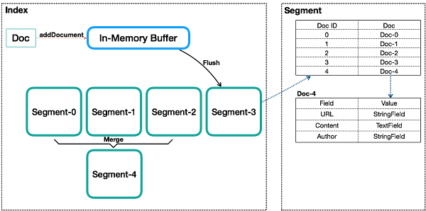
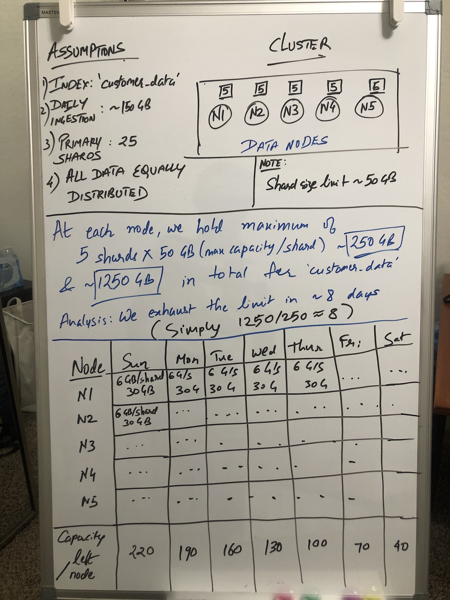

# ES_optimizations

### Why refresh interval is important and what shall we do about it?

Elasticsearch is near-realtime, in the sense that when you index a document, you need to wait for the next refresh for that document to appear in search. 
If you are planning to index a lot of documents and you don’t need the new information to be immediately available for search, you can optimize for indexing performance over search performance by decreasing refresh frequency until you are done indexing.
When documents are added to an ES index, they are divided into Shards. Shards of an index are in turn are composed of multiple segments.  


These segments are created with every refresh and subsequently merged together over time in the background.
The lucene working behind the scenes is responsible for segment merging, but if not handled carefully it can be computationally very expensive and may cause Elasticsearch to automatically throttle indexing requests to a single thread.(ouch!)

If you are planning to index a lot of documents and you don’t need the new information to be immediately available for search, you can optimize for indexing performance over search performance by decreasing refresh frequency until you are done indexing.

### When does my data becomes searchable?



The data is first ingested into an in-memory buffer which when overflows flushes the data and creates a sizeable segment. 
When a segment size grows up, different segments are clustered together thereby actually deleting the documents marked as `deleted` earlier. It is when inside segment that the data becomes searchable.

During a merge, Lucene takes 2 segments, and moves the content into a third, new one. Then the old segments are deleted from the disk. It means Lucene needs enough free space on the disk to create a segment the size of both segments it needs to merge.

A problem can arise when force merging a huge shard. If the shard size is > half of the disk size, you provably won’t be able to fully merge it, unless most of the data is made of deleted documents.

### How to shard our data?



As we can see if our daily ingestion rate for an index is quite high and our primary shards bit lower, we can run into trouble in a short time as all our shards for that index would've exhausted their individual capacities. 

These factors should determine our primary shards and sharding in general: 

1. Number of nodes (data nodes to be specific)
2. Disk space allocated on each of the nodes (in case of disk based shard allocation)
3. Daily ingestion rate (approximate) in the future

Other important things to note:

1. Data is always indexed into primary shards and primary shards cannot be changed once determined at time of index creation. 
2. If you start out with 25 primary shards, it won't help if you go beyond 25 nodes in the cluster because we won't get more primary shards.
3. If you keep indexing documents, shards will grow beyond their size and this degrades search performance. In which case we either have to do expensive deletes or reindex with new primary shards parameter.

Suggestions: 

1. Rather than running expensive deletes in big index, we can retire old index in one off-peak operation.
2. Multiple shards allow a better allocation between nodes.
3. Small shards on multiple nodes make the cluster recovery much faster when you lose a data node or shutdown the cluster.
4. Spreading smaller shards on lots of nodes might solve your memory management problems when running queries on a large data set.
5. We can different number of replicas for different indices, with more indices for new data to allow better search query performance. 
6. It is safer to reindex smaller indices at a time rather than one big index. If we are already using more than 50% of available disc on the nodes the reindexing won't happen. 
7. 10GB shards offers the most competitive balance between allocation speed, nodes balancing, and overall cluster management.
8. We can implement Hot-warm architecture :
 https://www.elastic.co/blog/implementing-hot-warm-cold-in-elasticsearch-with-index-lifecycle-management 

#### Optimal approach for sharding: 

With an average of 2GB for 1 million documents, for example, I'll use the following:
1. From 0 to 4 million documents per index: 1 shard.
2. From 4 to 5 million documents per index: 2 shards, so the index can still grow without causing too much problems in the future.
3. With more than 5 millions documents, (number of documents / 5 million) + 1 shard.
The more data nodes you have, the better it works when you need to work with thousands of huge indexes (up to 300 million documents) in the same cluster.

Small script for resizing and moving things: 

```
#!/bin/bash
for index in $(list of indexes); do
  documents=$(curl -XGET http://cluster:9200/${index}/_count 2>/dev/null | cut -f 2 -d : | cut -f 1 -d ',')
  
  if [ $counter -lt 4000000 ]; then
    shards=1
  elif [ $counter -lt 5000000 ]; then
      shards=2
  else
      shards=$(( $counter / 5000000 + 1)) 
  fi
  
  new_version=$(( $(echo ${index} | cut -f 1 -d _) + 1)) 
  index_name=$(echo ${index} | cut -f 2 -d _)
  
  curl -XPUT http://cluster:9200/${new_version}${index_name} -d '{  
  "number_of_shards" : '${shards}' 
  }'
curl -XPOST http://cluster:9200/_reindex -d '{ 
  "source": {
    "index": "'${index}'"
  },
  "dest": {
    "index": "'${new_version}${index_name}'"
  }
}'
done
```

Once we've reindexed, we are ready to move the alias to right index and delete the old one. 

### Ensuring Fault tolerance: 


Elasticsearch nodes come under 4 flavors:

1. Master nodes: Decides where to move data, reallocate missing data when a node leaves.
2. Ingest nodes: Pre-processes documents before actual documents are indexed. All nodes enable ingest by default.
3. Data nodes: Perform operations on data shards when queried/searched. 
4. Coordinating nodes: Smart load balancers; gather data from various shards on different data during aggregations/search/CRUD.

When we create or change an Elasticsearch cluster, we can select between one and three availability zones as:

1. A single availability zone is suitable for testing and development
2. Two availability zones are suitable for production use (with a tiebreaker)
3. Three availability zones are great for mission critical environments

When deploying clusters in multiple availability zones, shard allocation awareness ensures that primary shards and their replica shards are spread across different zones to minimize the risk of losing all shard copies at the same time.

#### Optimising shard allocation:

Once you use rack awareness, it might be interesting to optimise shard allocations using elasticsearch zones.

For example, if you have indices that are accessed more frequently than others, you might want to allocate more data nodes to those indices while the less frequently accessed indices have less resources allocated. This is extremely efficient with timestamped indices.

Let’s say you have 20 data nodes, and 30 indices, you can create 3 zones. Allocate your 30 nodes to these zones according to the needed resources:

* new: 15 nodes
* general: 10 nodes
* old: 5 nodes

Every day, run a crontab to reallocate your indices to their new zone. For example, move a less accessed index into the “general” zone:

```
curl -XPUT "localhost:9200/index/_settings" -H 'Content-Type: application/json' -d '
{
  "transient": {
    "cluster.routing.allocation.include._zone" : "general",
    "cluster.routing.allocation.exclude._zone" : "new,old"
  }
}
'
```

### Hardware:

1. #### Memory:

* Elasticsearch file system storage has an important impact on the cluster performances. We can pick up niofs for file system storage.

```
The NIO FS type stores the shard index on the file system (maps to Lucene NIOFSDirectory) using NIO. It allows multiple threads to read from the same file concurrently.
```

* We might also want to commit the exact amount of memory you want to allocate to the heap at startup. This prevents the node from swapping when trying to allocate the memory it needs because no more memory is available.

```
boostrap.memory_lock (previously bootstrap.mlockall)
```

2. #### Storage: